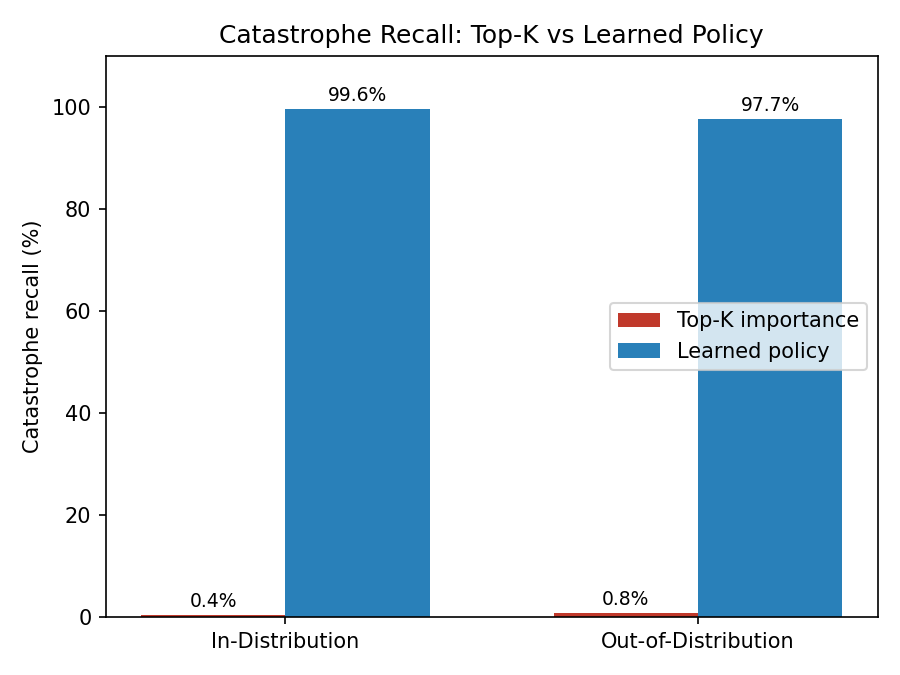
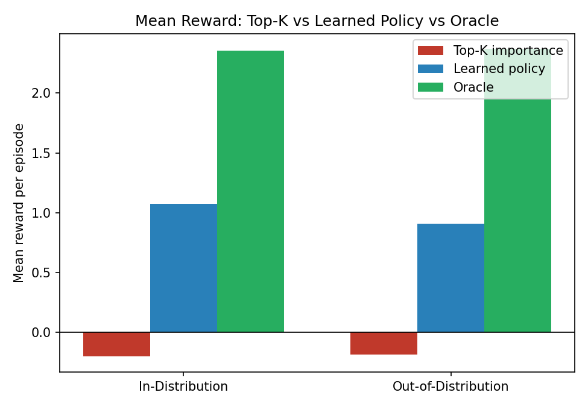
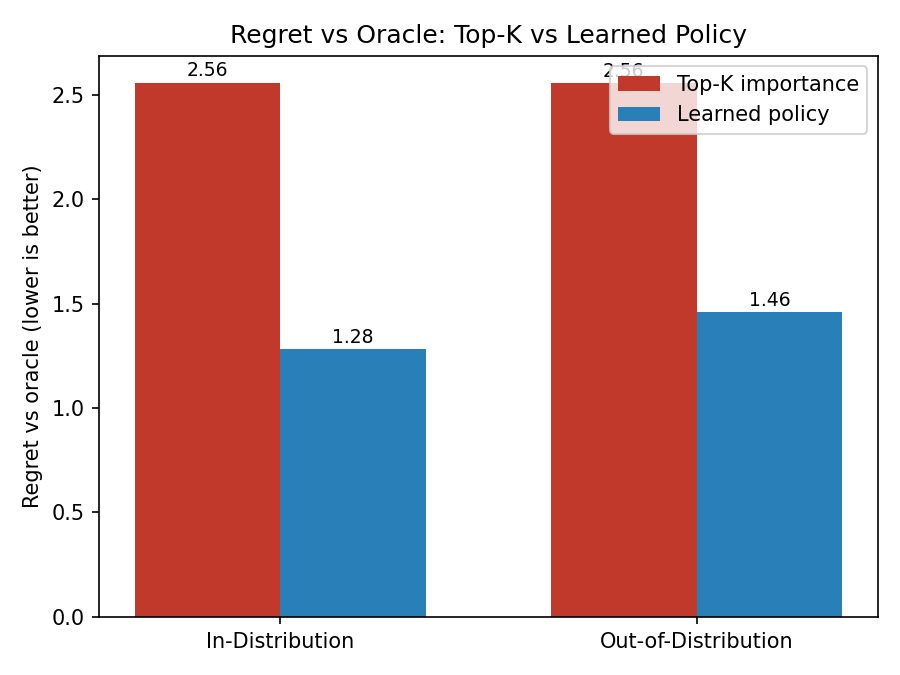

# ASTRA-SIFT 🚀

### Risk-Aware Satellite Information Selection Under Limited Communication Bandwidth

**ASTRA-SIFT** is a research prototype exploring how a satellite could decide **which observations are worth transmitting when it cannot send everything to Earth**.

A simple approach would be to select the observations with the highest **importance** scores. However, an observation can have low ordinary importance while still being unusual, uncertain, risky, or potentially high-consequence.

ASTRA-SIFT therefore evaluates observations using multiple signals:

- **Importance** — how useful the observation appears to be
- **Rarity** — how unusual it is
- **Novelty** — how different it is from other observations
- **Uncertainty** — how uncertain the system is about it
- **Risk** — estimated potential consequence
- **Redundancy** — whether similar information has already been selected

The goal is simple:

> **When communication capacity is limited, avoid automatically throwing away information that may turn out to matter.**

---

## 🚀 Live Demo

👉 https://astra-sift-esn4evkccjvz2qhwaj6cn5.streamlit.app/

The interactive demo allows you to:

- Generate a simulated satellite observation pass
- Compare **Top-K importance** against **ASTRA-SIFT**
- See which observations each method selects
- Check whether a critical observation is preserved
- View the experimental evaluation graphs

---

## 🎥 Demo Video

👉 https://drive.google.com/file/d/1G1_nT4E70yJS2MbMNat-uogt1qoNFwBq/view?usp=drivesdk

---

# 🧠 What I Built

The project was developed in three main stages.

### 1. Baseline Selection

A **Top-K importance** strategy selects the observations with the highest importance scores.

In simple terms:

> "Transmit the observations that look most important."

This provides a baseline for comparison.

### 2. ASTRA-SIFT Risk-Aware Selection

ASTRA-SIFT combines multiple signals instead of relying only on importance.

It also considers **redundancy between selected observations**, making the selection process batch-aware.

The policy uses a learned linear utility function and a simple black-box hill-climbing search to learn its weights.

### 3. Robustness Evaluation

The trained policy was evaluated in two environments:

**In-Distribution**

An environment from the same synthetic distribution family used during training.

**Out-of-Distribution (OOD)**

A harder environment containing changes such as:

- Different rare-event rates
- Additional sensor noise
- A noisier normal background
- Lower probability of rare events being truly consequential
- "Stealthy" high-consequence events with low rarity and novelty

The policy weights were **not retrained** for the OOD evaluation.

---
## 📁 Project Structure
ASTRA-SIFT/
├── .devcontainer/
├── README.md
├── app.py
├── requirements.txt
├── demo/
├── experiments/
└── results/
    └── figures/

# 📊 Experimental Results

The experiments are based on **synthetic satellite observations**, not real satellite data.

| Evaluation | Method | Catastrophe Recall | Mean Reward |
|---|---|---:|---:|
| In-Distribution | Top-K importance | 0.4% | -0.204 |
| In-Distribution | ASTRA-SIFT | **99.6%** | **1.073** |
| Out-of-Distribution | Top-K importance | 0.8% | -0.188 |
| Out-of-Distribution | ASTRA-SIFT | **97.7%** | **0.909** |

Within this controlled simulation, ASTRA-SIFT selected substantially more simulated high-consequence observations than the Top-K importance baseline.

The same trained policy also retained most of this advantage under the harder OOD conditions.

---

# 📈 Evaluation Graphs

### Catastrophe Recall

This measures how many simulated high-consequence events were successfully selected for transmission.

### Mean Reward

This shows the average simulated reward obtained by each selection strategy.

### Regret vs Oracle

This shows how far each strategy is from an evaluation-only oracle.

---

# 🔬 Key Demonstration

The demo includes a deliberately constructed case containing:

- Several ordinary observations with higher importance
- One observation with low ordinary importance
- High rarity and novelty
- High uncertainty and risk
- A limited transmission budget

The **Top-K importance** strategy drops the critical observation.

**ASTRA-SIFT selects it.**

A second "stealthy" scenario makes the problem harder by giving the critical observation **low rarity and low novelty**, while retaining high uncertainty and risk.

This tests whether the system is simply relying on obvious anomaly signals.

---

# ⚙️ Technical Approach

The selection policy uses a sequential greedy strategy.

For each candidate observation, the system considers:

importance
+ rarity
+ novelty
+ uncertainty
+ risk
- redundancy

# ⚙️ Technologies

Python
NumPy
Matplotlib
Streamlit

# 🔭 Scope & Current Prototype

ASTRA-SIFT is currently a **synthetic research prototype** designed to validate the core selection concept in a controlled environment.

The current implementation uses simulated satellite observations rather than:

- Real satellite imagery
- Real satellite sensor data
- Real satellite hardware
- Real communication links
- Real ground-station infrastructure
- Real-world hazard or consequence models

The reported results therefore demonstrate the behavior of the proposed selection approach **within the simulation** rather than real-world satellite performance.

The next stage of the project would be to evaluate the approach using real satellite observations or richer satellite-data representations.

## Why I Built This

This project explores a broader problem in intelligent systems:

When a system cannot process, store, or transmit everything, how should it decide what information must not be missed?

ASTRA-SIFT is an initial exploration of combining risk, uncertainty, novelty, rarity, importance, and redundancy to make that decision more robust.

👤 Author

GUNUPUDI SURYA SWARNITHA
Computer Science & AI/ML Student
Interested in AI, Machine Learning, Quantum Computing, Robotics, and Deep-Tech Systems.
